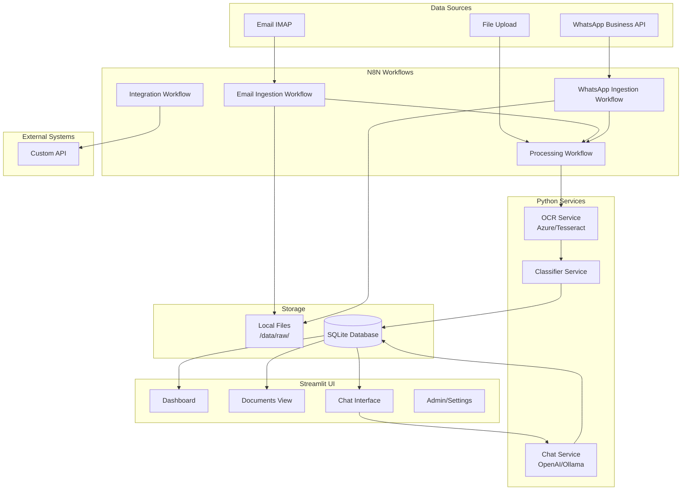

# Information Collection System - REVISED Solution Design (Local-First)

## Executive Summary

**Major Changes Based on User Feedback:**
- ✅ **Local-First Deployment**: Run on local machine/server (no cloud costs initially)
- ✅ **N8N for Workflows**: Visual workflow automation for ingestion and routing
- ✅ **Streamlit for UI**: Rapid Python-based web interface
- ✅ **Python-Heavy**: All processing in Python for simplicity
- ✅ **Cost-Effective**: Free/open-source tools, minimal API costs
- ✅ **1-Week MVP Timeline**: Aggressive but achievable scope

---

## 1. Revised Technology Stack (Local & Cost-Effective)

### 1.1 Core Platform
| Component | Technology | Cost | Why? |
|-----------|-----------|------|------|
| **Workflow Engine** | N8N (self-hosted) | FREE | Visual workflow builder, 400+ integrations |
| **Backend** | Python 3.11+ | FREE | OCR, processing, ML, chat |
| **UI Framework** | Streamlit | FREE | Rapid Python web apps |
| **Database** | SQLite (MVP) → PostgreSQL | FREE | Simple start, easy upgrade |
| **File Storage** | Local filesystem | FREE | No S3 costs |
| **Message Queue** | N8N built-in | FREE | Included in N8N |
| **Containerization** | Docker Compose | FREE | Easy local deployment |

### 1.2 AI/ML Services (Pay-per-use)
| Service | Provider | Estimated Cost (MVP) |
|---------|----------|---------------------|
| **OCR** | Azure Form Recognizer | ~$50-150/month (1000 docs) |
| **LLM (Chat)** | OpenAI GPT-4o-mini | ~$20-50/month (cheaper model) |
| **Alternative OCR** | Tesseract (open-source) | FREE (lower accuracy) |
| **Alternative LLM** | Ollama (local) | FREE (requires GPU) |

**Total Estimated Monthly Cost: $70-200** (vs. $700-1,700 in cloud version)

### 1.3 Integrations
- **Email**: N8N Email Trigger (IMAP)
- **WhatsApp**: N8N WhatsApp Business API node
- **Custom API**: N8N Webhook + HTTP Request nodes
- **SMS**: N8N Twilio node (optional)

---

## 2. Revised Architecture

### 2.1 High-Level Architecture (Local Deployment)



### 2.2 N8N Workflow Examples

#### Email Ingestion Workflow
```
[Email Trigger (IMAP)] 
  → [Filter: Has Attachment] 
  → [Extract Attachments] 
  → [Save to Local Files] 
  → [HTTP Request: Python OCR Service] 
  → [Save to SQLite] 
  → [Evaluate Rules] 
  → [HTTP Request: Custom API if matched]
```

#### WhatsApp Ingestion Workflow
```
[WhatsApp Trigger (Webhook)] 
  → [Download Media] 
  → [Save to Local Files] 
  → [HTTP Request: Python OCR Service] 
  → [Save to SQLite] 
  → [Send WhatsApp Confirmation]
```

---

## 3. Detailed Component Design

### 3.1 N8N Workflows (Orchestration Layer)

**Why N8N?**
- Visual workflow builder (no-code/low-code)
- 400+ pre-built integrations
- Self-hosted (free, no cloud costs)
- Built-in scheduling, error handling, retry logic
- Webhook support for real-time triggers
- Can call Python services via HTTP

**Key Workflows to Build:**

1. **Email Ingestion** (`email_ingestion.json`)
   - Trigger: IMAP Email (poll every 5 min)
   - Filter: Has attachments
   - Extract: Download attachments
   - Save: Local filesystem
   - Process: Call Python OCR service
   - Store: Save results to SQLite
   - Route: Check rules, call custom API if needed

2. **WhatsApp Ingestion** (`whatsapp_ingestion.json`)
   - Trigger: Webhook (real-time)
   - Download: Media from WhatsApp
   - Save: Local filesystem
   - Process: Call Python OCR service
   - Store: Save to SQLite
   - Respond: Send confirmation message

3. **Manual Upload Processing** (`upload_processing.json`)
   - Trigger: Webhook from Streamlit
   - Process: Call Python OCR service
   - Store: Save to SQLite

4. **Custom API Integration** (`api_integration.json`)
   - Trigger: Database change (via webhook)
   - Transform: Map data to API format
   - Send: HTTP POST to custom API
   - Log: Record integration status

### 3.2 Python Services (Processing Layer)

**Service 1: OCR Service** (`services/ocr_service.py`)
```python
from fastapi import FastAPI, UploadFile
from azure.ai.formrecognizer import DocumentAnalysisClient
import pytesseract  # Fallback

app = FastAPI()

@app.post("/ocr/invoice")
async def extract_invoice(file: UploadFile):
    # Try Azure Form Recognizer first
    try:
        result = azure_extract(file)
        return {"status": "success", "data": result, "engine": "azure"}
    except:
        # Fallback to Tesseract
        result = tesseract_extract(file)
        return {"status": "success", "data": result, "engine": "tesseract"}
```

**Service 2: Classification Service** (`services/classifier.py`)
```python
@app.post("/classify")
async def classify_document(data: dict):
    # Simple rule-based for MVP
    text = data.get("text", "").lower()
    
    if "invoice" in text or "bill to" in text:
        return {"type": "invoice", "confidence": 0.9}
    elif "receipt" in text:
        return {"type": "receipt", "confidence": 0.85}
    else:
        return {"type": "other", "confidence": 0.5}
```

**Service 3: Chat Service** (`services/chat_service.py`)
```python
from openai import OpenAI
import sqlite3

@app.post("/chat")
async def chat_query(query: str):
    # Get relevant data from SQLite
    conn = sqlite3.connect("data/database.db")
    
    # Simple NL to SQL (for MVP, use predefined patterns)
    sql = convert_query_to_sql(query)
    results = conn.execute(sql).fetchall()
    
    # Use OpenAI to format response
    client = OpenAI()
    response = client.chat.completions.create(
        model="gpt-4o-mini",  # Cheaper model
        messages=[
            {"role": "system", "content": "You are a helpful assistant for expense data."},
            {"role": "user", "content": f"Query: {query}\nData: {results}\nProvide a natural language answer."}
        ]
    )
    
    return {"answer": response.choices[0].message.content}
```

### 3.3 Streamlit UI (Presentation Layer)

**Main App** (`app.py`)
```python
import streamlit as st
import sqlite3
import requests

st.set_page_config(page_title="Info Collection System", layout="wide")

# Sidebar navigation
page = st.sidebar.selectbox("Navigate", ["Dashboard", "Upload", "Documents", "Chat", "Settings"])

if page == "Dashboard":
    show_dashboard()
elif page == "Upload":
    show_upload()
elif page == "Documents":
    show_documents()
elif page == "Chat":
    show_chat()
elif page == "Settings":
    show_settings()
```

**Dashboard Page** (`pages/dashboard.py`)
```python
def show_dashboard():
    st.title("📊 Dashboard")
    
    # Metrics
    col1, col2, col3, col4 = st.columns(4)
    with col1:
        st.metric("Total Documents", get_total_docs())
    with col2:
        st.metric("This Month", get_month_docs())
    with col3:
        st.metric("Total Amount", f"${get_total_amount():,.2f}")
    with col4:
        st.metric("Pending Review", get_pending_count())
    
    # Recent documents
    st.subheader("Recent Documents")
    df = get_recent_documents()
    st.dataframe(df)
    
    # Chart
    st.subheader("Expenses by Category")
    chart_data = get_category_breakdown()
    st.bar_chart(chart_data)
```

**Upload Page** (`pages/upload.py`)
```python
def show_upload():
    st.title("📤 Upload Document")
    
    uploaded_file = st.file_uploader("Choose a file", type=["pdf", "jpg", "png", "jpeg"])
    
    if uploaded_file:
        # Save file
        file_path = save_uploaded_file(uploaded_file)
        
        # Trigger N8N workflow via webhook
        with st.spinner("Processing document..."):
            response = requests.post(
                "http://localhost:5678/webhook/upload",
                json={"file_path": file_path}
            )
        
        if response.status_code == 200:
            st.success("Document processed successfully!")
            st.json(response.json())
        else:
            st.error("Processing failed")
```

**Chat Page** (`pages/chat.py`)
```python
def show_chat():
    st.title("💬 Chat Assistant")
    
    # Chat history
    if "messages" not in st.session_state:
        st.session_state.messages = []
    
    # Display messages
    for msg in st.session_state.messages:
        with st.chat_message(msg["role"]):
            st.write(msg["content"])
    
    # Input
    if prompt := st.chat_input("Ask a question..."):
        st.session_state.messages.append({"role": "user", "content": prompt})
        
        # Call chat service
        response = requests.post(
            "http://localhost:8001/chat",
            json={"query": prompt}
        )
        
        answer = response.json()["answer"]
        st.session_state.messages.append({"role": "assistant", "content": answer})
        st.rerun()
```

### 3.4 Database Schema (SQLite for MVP)

```sql
-- documents table
CREATE TABLE documents (
    id INTEGER PRIMARY KEY AUTOINCREMENT,
    source TEXT NOT NULL,  -- email, whatsapp, upload
    source_id TEXT,
    document_type TEXT,  -- invoice, receipt, bill
    status TEXT DEFAULT 'pending',
    confidence_score REAL,
    file_path TEXT NOT NULL,
    uploaded_at TIMESTAMP DEFAULT CURRENT_TIMESTAMP,
    processed_at TIMESTAMP,
    metadata TEXT  -- JSON string
);

-- transactions table
CREATE TABLE transactions (
    id INTEGER PRIMARY KEY AUTOINCREMENT,
    document_id INTEGER REFERENCES documents(id),
    vendor_name TEXT,
    invoice_number TEXT,
    transaction_date DATE,
    amount REAL,
    currency TEXT DEFAULT 'USD',
    tax_amount REAL,
    category TEXT,
    department TEXT,
    status TEXT DEFAULT 'pending',
    notes TEXT,
    metadata TEXT  -- JSON string
);

-- categories table (sample data)
CREATE TABLE categories (
    id INTEGER PRIMARY KEY AUTOINCREMENT,
    name TEXT UNIQUE NOT NULL,
    parent_id INTEGER REFERENCES categories(id),
    department TEXT
);

-- Sample categories
INSERT INTO categories (name, department) VALUES
    ('IT & Software', 'IT'),
    ('Marketing & Advertising', 'Marketing'),
    ('Office Supplies', 'Operations'),
    ('Travel & Entertainment', 'Operations'),
    ('Utilities', 'Operations'),
    ('Professional Services', 'Finance'),
    ('HR & Recruitment', 'HR');
```

---

## 4. Docker Compose Setup (Local Deployment)

**docker-compose.yml**
```yaml
version: '3.8'

services:
  # N8N Workflow Engine
  n8n:
    image: n8nio/n8n:latest
    ports:
      - "5678:5678"
    environment:
      - N8N_BASIC_AUTH_ACTIVE=true
      - N8N_BASIC_AUTH_USER=admin
      - N8N_BASIC_AUTH_PASSWORD=admin123
    volumes:
      - ./data/n8n:/home/node/.n8n
    restart: unless-stopped

  # Python Services (OCR, Classification, Chat)
  python-services:
    build: ./services
    ports:
      - "8001:8001"
    environment:
      - AZURE_FORM_RECOGNIZER_KEY=${AZURE_KEY}
      - AZURE_FORM_RECOGNIZER_ENDPOINT=${AZURE_ENDPOINT}
      - OPENAI_API_KEY=${OPENAI_KEY}
    volumes:
      - ./data:/app/data
    restart: unless-stopped

  # Streamlit UI
  streamlit:
    build: ./frontend
    ports:
      - "8501:8501"
    volumes:
      - ./data:/app/data
    depends_on:
      - python-services
    restart: unless-stopped
```

---

## 5. Cost Breakdown (Monthly)

### 5.1 Infrastructure Costs
| Component | Cost |
|-----------|------|
| Local server/computer | $0 (existing hardware) |
| Docker | $0 (free) |
| N8N | $0 (self-hosted) |
| SQLite | $0 (free) |
| **Total Infrastructure** | **$0** |

### 5.2 API Costs (Pay-per-use)
| Service | Usage (MVP) | Cost |
|---------|-------------|------|
| Azure Form Recognizer | 1,000 docs/month | ~$100 |
| OpenAI GPT-4o-mini | 500 queries/month | ~$20 |
| WhatsApp Business API | 1,000 messages | ~$10 |
| **Total API Costs** | | **~$130/month** |

### 5.3 Alternative (Even Lower Cost)
| Service | Alternative | Cost |
|---------|-------------|------|
| OCR | Tesseract (open-source) | $0 |
| LLM | Ollama (local Llama 3) | $0 (requires GPU) |
| WhatsApp | Manual upload only | $0 |
| **Ultra-Low-Cost Total** | | **$0-20/month** |

---

## 6. Implementation Timeline (1 Week)

### Day 1-2: Setup & Infrastructure
- ✅ Install Docker, Docker Compose
- ✅ Set up N8N container
- ✅ Create SQLite database schema
- ✅ Set up project structure
- ✅ Configure environment variables

### Day 3-4: Core Processing
- ✅ Build Python OCR service (Azure + Tesseract fallback)
- ✅ Build classification service
- ✅ Create N8N workflows (Email + WhatsApp ingestion)
- ✅ Test end-to-end document processing

### Day 5-6: UI & Chat
- ✅ Build Streamlit dashboard
- ✅ Build upload page
- ✅ Build documents view
- ✅ Build chat assistant with OpenAI
- ✅ Test all UI flows

### Day 7: Integration & Testing
- ✅ Build custom API integration workflow in N8N
- ✅ End-to-end testing
- ✅ Documentation
- ✅ Demo preparation

---

## 7. Advantages of This Approach

### 7.1 Cost Benefits
- **$0 infrastructure** vs. $200-500/month cloud
- **$130/month APIs** vs. $700-1,700/month total
- **90% cost reduction**

### 7.2 Development Speed
- **N8N visual workflows** = faster than coding
- **Streamlit** = rapid UI development
- **Python-only** = single language, simpler
- **Local deployment** = no cloud setup time

### 7.3 Flexibility
- Easy to migrate to cloud later
- Can swap services (Tesseract ↔ Azure OCR)
- Can add/modify workflows visually
- SQLite → PostgreSQL upgrade path

### 7.4 Learning & Control
- Full control over all components
- Easy debugging (everything local)
- No vendor lock-in
- Great for POC/prototype

---

## 8. Migration Path to Production

When ready to scale:

1. **Database**: SQLite → PostgreSQL (same schema)
2. **Storage**: Local files → AWS S3 / MinIO
3. **N8N**: Self-hosted → N8N Cloud (optional)
4. **Streamlit**: Local → Streamlit Cloud / Docker deployment
5. **Services**: Single server → Kubernetes cluster

---

## 9. Sample Expense Categories

```python
SAMPLE_CATEGORIES = {
    "IT & Technology": [
        "Software Subscriptions",
        "Cloud Services (AWS, Azure, GCP)",
        "Hardware & Equipment",
        "IT Support & Maintenance"
    ],
    "Marketing & Sales": [
        "Digital Advertising",
        "Content Creation",
        "Events & Sponsorships",
        "Marketing Tools & Software"
    ],
    "Operations": [
        "Office Rent",
        "Utilities (Electricity, Water, Internet)",
        "Office Supplies",
        "Cleaning & Maintenance"
    ],
    "Human Resources": [
        "Recruitment",
        "Training & Development",
        "Employee Benefits",
        "Payroll Services"
    ],
    "Finance & Legal": [
        "Accounting Services",
        "Legal Fees",
        "Banking Fees",
        "Insurance"
    ],
    "Travel & Entertainment": [
        "Business Travel",
        "Accommodation",
        "Meals & Entertainment",
        "Transportation"
    ]
}
```

---

## 10. Next Steps

1. ✅ **Review this revised design**
2. ✅ **Approve to proceed with implementation**
3. 🚀 **Start Day 1: Environment setup**
4. 🚀 **Follow 7-day implementation plan**

---

*This revised solution design provides a practical, cost-effective, local-first approach that can be delivered in 1 week while maintaining the core functionality of the original design.*
