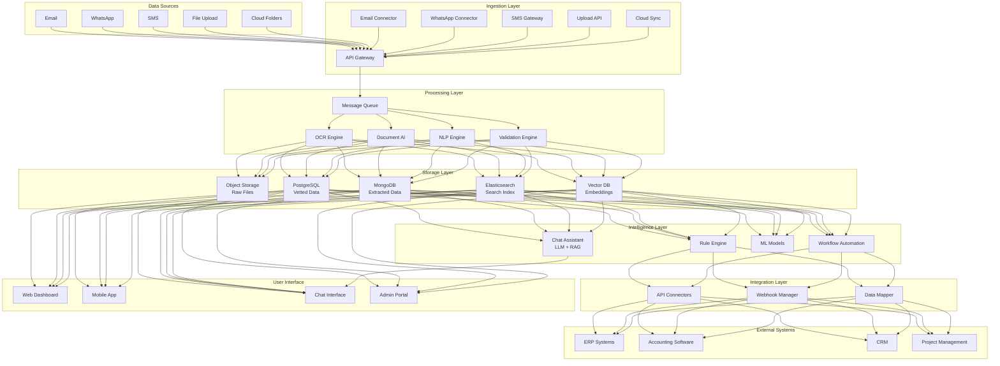
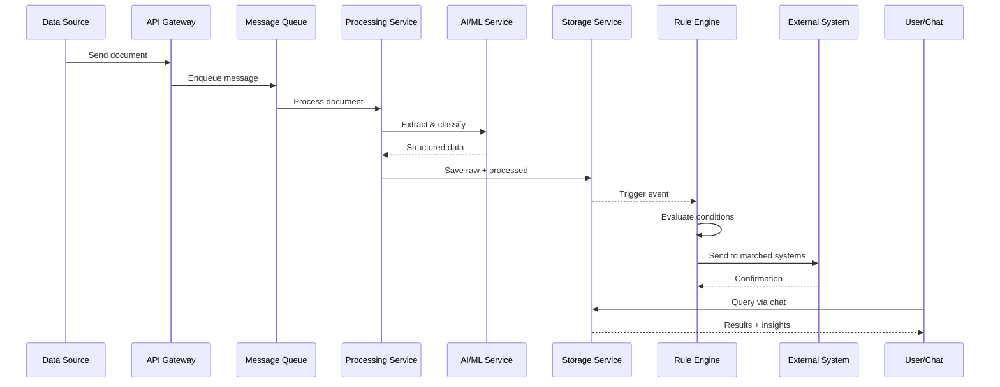

# Information Collection & Processing System - Solution Design

## 1. Executive Summary

This document outlines the detailed solution design for an intelligent information collection and processing system that automates the ingestion, processing, categorization, and distribution of business documents from multiple sources.

### Key Capabilities
- **Multi-source Ingestion**: Email, WhatsApp, SMS, file uploads, cloud folders
- **Intelligent Processing**: OCR, document classification, entity extraction
- **Automated Workflows**: Rule-based routing to external systems
- **AI Chat Assistant**: Natural language querying and reporting
- **Predictive Analytics**: Historical analysis and forecasting

---

## 2. Recommended Technology Stack

### 2.1 Core Platform
- **Cloud Provider**: AWS (recommended) or Azure
- **Backend Framework**: FastAPI (Python 3.11+)
- **Frontend**: React + TypeScript + Tailwind CSS
- **Mobile**: React Native (iOS + Android)
- **Containerization**: Docker + Kubernetes

### 2.2 Data Storage
- **Object Storage**: AWS S3 (raw files)
- **Primary Database**: PostgreSQL 15+ (vetted data)
- **Document Store**: MongoDB (flexible extracted data)
- **Search Engine**: Elasticsearch 8.x
- **Vector Database**: Pinecone or Weaviate (AI embeddings)
- **Cache**: Redis 7.x

### 2.3 AI/ML Services
- **OCR**: Azure Form Recognizer + Google Vision API (fallback)
- **LLM**: OpenAI GPT-4 or Google Gemini Pro
- **Embeddings**: OpenAI text-embedding-3-small
- **ML Framework**: scikit-learn, TensorFlow/PyTorch
- **ML Ops**: MLflow for model tracking

### 2.4 Integration & Messaging
- **Message Queue**: RabbitMQ or AWS SQS
- **Workflow Engine**: Apache Airflow
- **API Gateway**: Kong or AWS API Gateway
- **Monitoring**: Prometheus + Grafana, Datadog

### 2.5 External Integrations
- **Email**: Microsoft Graph API, Gmail API
- **WhatsApp**: WhatsApp Business API (official)
- **SMS**: Twilio
- **Cloud Storage**: Google Drive API, OneDrive API
- **Accounting**: QuickBooks API, Xero API

---

## 3. System Architecture

### 3.1 High-Level Architecture Diagram



### 3.2 Data Flow Sequence



---

## 4. Detailed Component Design

### 4.1 Ingestion Layer

#### Email Connector
- **Technology**: Microsoft Graph API (Office 365) or Gmail API
- **Polling Interval**: 1-5 minutes
- **Features**: Attachment download, email filtering, OAuth authentication
- **Configuration**: Support multiple mailboxes, custom filters

#### WhatsApp Connector
- **Technology**: WhatsApp Business API (Official)
- **Delivery**: Real-time webhooks
- **Media Support**: Images, PDFs, documents, voice notes
- **Two-way**: Send confirmations and status updates

#### File Upload API
- **Technology**: FastAPI with multipart/form-data
- **Features**: Drag-drop UI, mobile camera, virus scanning, progress tracking
- **Validation**: File type, size limits, format verification

#### Cloud Folder Sync
- **Technology**: Google Drive API, OneDrive API, Dropbox API
- **Sync Mode**: Real-time (webhooks) or scheduled
- **Features**: Folder monitoring, incremental sync, conflict resolution

### 4.2 Processing Layer

#### Message Queue
- **Technology**: RabbitMQ or AWS SQS
- **Pattern**: Producer-consumer with multiple queues
- **Features**: Priority queuing, dead letter queue, retry logic
- **Queues**: ingestion → processing → validation → storage → integration

#### OCR & Document Intelligence
- **Primary**: Azure Form Recognizer (best for invoices/receipts)
- **Fallback**: Google Vision API or AWS Textract
- **Pipeline**: Preprocessing → OCR → Layout analysis → Entity extraction
- **Output**: Structured JSON with confidence scores

#### Document Classification
- **Approach**: ML classifier (Random Forest or BERT)
- **Categories**: Invoice, Receipt, Bill, Contract, Purchase Order, Other
- **Training**: Labeled dataset of 1000+ documents
- **Fallback**: Rule-based classification using keywords

#### Validation Engine
- **Checks**: Required fields, format validation, duplicate detection, amount verification
- **Levels**: Auto-approve (>95% confidence), Review (70-95%), Reject (<70%)
- **Output**: Validation report with issues flagged

### 4.3 Storage Layer

#### Object Storage (S3)
- **Structure**: `/raw-files/YYYY/MM/DD/{source}/{document_id}.{ext}`
- **Metadata**: Source, timestamp, checksum, file type
- **Lifecycle**: Archive to Glacier after 90 days

#### PostgreSQL Database
**Key Tables**:
- `documents`: Document metadata and status
- `transactions`: Extracted financial data
- `transaction_items`: Line items
- `categories`: Expense categories
- `workflow_rules`: Automation rules
- `audit_log`: Complete audit trail

**Indexes**: Status, date, category, department for fast queries

#### MongoDB
- **Collections**: `raw_extractions`, `processing_logs`, `failed_documents`
- **Use Case**: Store unstructured/semi-structured data before validation

#### Elasticsearch
- **Purpose**: Full-text search, faceted search, analytics
- **Indexes**: Documents, transactions with full content
- **Features**: Autocomplete, aggregations, highlighting

#### Vector Database
- **Technology**: Pinecone or Weaviate
- **Purpose**: Semantic search for chat assistant (RAG)
- **Process**: Generate embeddings → Store with metadata → Query for relevant docs

### 4.4 Intelligence Layer

#### Rule Engine
- **Design**: JSON-based rule configuration
- **Structure**: Conditions (AND/OR logic) + Actions
- **Actions**: API calls, notifications, data updates, approvals
- **Evaluation**: Priority-based, multiple rules can match

**Example Rule**:
```json
{
  "name": "Route marketing expenses to HubSpot",
  "conditions": [
    {"field": "category", "operator": "equals", "value": "Marketing"},
    {"field": "amount", "operator": "greater_than", "value": 1000}
  ],
  "actions": [
    {"type": "api_call", "endpoint": "hubspot_expenses"},
    {"type": "notification", "recipients": ["marketing@company.com"]}
  ]
}
```

#### Workflow Automation
- **Technology**: Apache Airflow
- **Workflows**: Invoice processing, approval routing, data synchronization
- **Features**: DAG-based, retry logic, monitoring, scheduling

#### ML Models
1. **Document Classifier**: CNN/BERT for document type identification
2. **Category Predictor**: Random Forest for expense categorization
3. **Expense Forecaster**: Prophet/LSTM for trend prediction
4. **Anomaly Detector**: Isolation Forest for unusual transaction detection

#### Chat Assistant (RAG)
- **Architecture**: LLM + Vector DB + SQL Generator
- **Capabilities**:
  - Natural language to SQL queries
  - Document semantic search
  - Analytics and aggregations
  - Chart/report generation
- **Technology**: LangChain or LlamaIndex + OpenAI GPT-4

### 4.5 Integration Layer

#### API Connector Framework
- **Pattern**: Strategy pattern for different systems
- **Base Interface**: authenticate(), send_transaction(), get_status(), handle_error()
- **Implementations**: QuickBooks, Xero, SAP, Salesforce, custom APIs
- **Features**: OAuth handling, rate limiting, retry logic, error handling

#### Webhook Manager
- **Features**: Register webhooks, receive events, validate signatures, queue processing
- **Endpoints**: `/webhooks/register`, `/webhooks/{source}`, `/webhooks/{id}/logs`

#### Data Mapper
- **Purpose**: Transform internal format to external system format
- **Configuration**: JSON-based mapping rules
- **Features**: Field mapping, data transformation, lookup tables

### 4.6 User Interface

#### Web Dashboard
- **Technology**: React + TypeScript + Tailwind CSS
- **Pages**: Dashboard, Documents, Transactions, Analytics, Chat, Settings
- **Features**: Real-time updates (WebSocket), responsive, dark mode, export

#### Mobile App
- **Technology**: React Native
- **Features**: Camera capture, gallery upload, push notifications, offline mode, quick approval

#### Chat Interface
- **Design**: Conversational UI with rich responses
- **Features**: Text/voice input, tables, charts, follow-up questions, export

---

## 5. Security Architecture

### 5.1 Authentication & Authorization
- **User Auth**: OAuth 2.0 + JWT tokens
- **API Auth**: API keys + OAuth for external integrations
- **RBAC**: Role-based access control (Admin, Manager, User, Viewer)
- **MFA**: Multi-factor authentication for sensitive operations

### 5.2 Data Security
- **Encryption at Rest**: AES-256 for databases and object storage
- **Encryption in Transit**: TLS 1.3 for all communications
- **PII Protection**: Detect and mask sensitive data
- **Data Retention**: Configurable retention policies with auto-deletion

### 5.3 API Security
- **Rate Limiting**: Per-user and per-IP limits
- **Input Validation**: Strict validation on all inputs
- **CORS**: Configured for allowed origins
- **API Gateway**: Centralized security policies

### 5.4 Compliance
- **GDPR**: Data privacy, consent, right to deletion
- **SOC 2**: Security controls and audit trails
- **Industry-specific**: HIPAA, PCI-DSS (if applicable)

### 5.5 Audit & Monitoring
- **Audit Logs**: Complete trail of all actions
- **Security Monitoring**: Intrusion detection, anomaly detection
- **Alerts**: Real-time alerts for security events
- **Compliance Reports**: Automated compliance reporting

---

## 6. Scalability & Performance

### 6.1 Horizontal Scaling
- **Containerization**: Docker containers for all services
- **Orchestration**: Kubernetes for auto-scaling
- **Load Balancing**: NGINX or AWS ALB
- **Stateless Services**: Enable easy scaling

### 6.2 Performance Optimization
- **Caching**: Redis for frequently accessed data
- **CDN**: CloudFront for static assets
- **Database**: Indexing, query optimization, read replicas
- **Async Processing**: Queue-based for heavy operations

### 6.3 Capacity Planning
**POC Estimates**:
- Documents/day: 100-1,000
- Storage growth: 10-100 GB/month
- API calls: 1,000-10,000/day
- Concurrent users: 10-50

**Production Estimates**:
- Documents/day: 10,000+
- Storage growth: 1-10 TB/month
- API calls: 100,000+/day
- Concurrent users: 500+

---

## 7. Disaster Recovery & Business Continuity

### 7.1 Backup Strategy
- **Database**: Daily full backups + continuous WAL archiving
- **Object Storage**: S3 versioning + cross-region replication
- **Retention**: 30 days online, 1 year archive

### 7.2 High Availability
- **Multi-AZ Deployment**: Across availability zones
- **Database**: Primary + read replicas with auto-failover
- **Application**: Multiple instances behind load balancer
- **Uptime Target**: 99.9% (< 9 hours downtime/year)

### 7.3 Disaster Recovery
- **RTO (Recovery Time Objective)**: 4 hours
- **RPO (Recovery Point Objective)**: 1 hour
- **DR Site**: Cross-region backup in different geography
- **Testing**: Quarterly DR drills

---

## 8. Monitoring & Observability

### 8.1 Application Monitoring
- **Metrics**: Prometheus for metrics collection
- **Visualization**: Grafana dashboards
- **APM**: Application performance monitoring (Datadog, New Relic)
- **Logs**: Centralized logging (ELK stack or CloudWatch)

### 8.2 Key Metrics
- **System**: CPU, memory, disk, network
- **Application**: Request rate, response time, error rate
- **Business**: Documents processed, success rate, processing time
- **ML**: Model accuracy, confidence scores, prediction latency

### 8.3 Alerting
- **Channels**: Email, Slack, PagerDuty
- **Severity Levels**: Critical, Warning, Info
- **Escalation**: Auto-escalation for unresolved critical alerts

---

## 9. Cost Estimation (Monthly)

### POC Environment (100-1,000 docs/day)
| Component | Service | Estimated Cost |
|-----------|---------|----------------|
| Compute | AWS EC2/ECS | $200-500 |
| Database | RDS PostgreSQL | $100-200 |
| Storage | S3 | $50-100 |
| AI Services | Azure Form Recognizer, OpenAI | $300-800 |
| Monitoring | Datadog/CloudWatch | $50-100 |
| **Total** | | **$700-1,700/month** |

### Production Environment (10,000+ docs/day)
| Component | Service | Estimated Cost |
|-----------|---------|----------------|
| Compute | Kubernetes cluster | $1,500-3,000 |
| Database | RDS Multi-AZ | $500-1,000 |
| Storage | S3 + Glacier | $200-500 |
| AI Services | Azure, OpenAI | $2,000-5,000 |
| Monitoring | Enterprise | $300-500 |
| **Total** | | **$4,500-10,000/month** |

---

## 10. Implementation Phases

### Phase 1: MVP (4-6 weeks)
**Scope**:
- Email ingestion
- Basic OCR (Azure Form Recognizer)
- PostgreSQL storage
- Simple categorization
- Mock external API integration
- Basic web dashboard
- Simple chat queries

**Deliverables**:
- Working end-to-end flow
- Basic UI for document viewing
- Simple chat interface
- Documentation

### Phase 2: Enhanced POC (6-8 weeks)
**Scope**:
- WhatsApp integration
- ML-based categorization
- Rule engine
- Real external system integration (QuickBooks/Xero)
- Advanced chat with RAG
- Analytics dashboard
- Mobile app (basic)

**Deliverables**:
- Production-ready prototype
- Multiple data sources
- Automated workflows
- Advanced analytics

### Phase 3: Production (8-12 weeks)
**Scope**:
- All data sources (SMS, cloud folders)
- Advanced ML models
- Comprehensive integrations
- Full security hardening
- Complete monitoring
- Performance optimization
- User training

**Deliverables**:
- Production-ready system
- Complete documentation
- Training materials
- Support processes

---

## 11. Success Criteria

### Technical Success
- [ ] 95%+ uptime
- [ ] 90%+ OCR accuracy
- [ ] 80%+ auto-categorization accuracy
- [ ] < 2 minutes average processing time
- [ ] < 500ms API response time (p95)
- [ ] Zero data loss

### Business Success
- [ ] 70%+ reduction in manual data entry time
- [ ] 50%+ faster expense reporting
- [ ] 90%+ user satisfaction score
- [ ] ROI positive within 6 months
- [ ] 95%+ of documents processed without manual intervention

---

## 12. Risks & Mitigation

| Risk | Impact | Probability | Mitigation |
|------|--------|-------------|------------|
| WhatsApp API rate limits | High | Medium | Implement queuing, use official API, monitor limits |
| OCR accuracy issues | Medium | Medium | Multi-engine approach, human review for low confidence |
| Integration failures | High | Medium | Robust retry logic, fallback mechanisms, monitoring |
| Data privacy breach | Critical | Low | Encryption, access controls, security audits |
| Cost overruns | Medium | Medium | Budget alerts, resource optimization, usage monitoring |
| LLM hallucinations | Medium | Medium | RAG implementation, response validation, human oversight |
| Vendor lock-in | Medium | Low | Abstract integrations, use open standards |

---

## 13. Next Steps

1. **Stakeholder Review**: Review and approve this solution design
2. **Architecture Refinement**: Create detailed architecture diagrams
3. **Implementation Planning**: Detailed task breakdown and timeline
4. **Environment Setup**: Cloud accounts, development environment
5. **Prototype Development**: Start Phase 1 MVP
6. **Testing Strategy**: Define test cases and acceptance criteria
7. **Documentation**: API docs, user guides, admin manuals

---

## Appendix A: Technology Alternatives

### Cloud Providers
- **AWS**: Most comprehensive, mature ecosystem
- **Azure**: Best for Microsoft shops, excellent AI services
- **GCP**: Superior AI/ML capabilities, BigQuery
- **Recommendation**: AWS for general use, Azure if heavy Microsoft integration

### LLM Providers
- **OpenAI GPT-4**: Most capable, expensive
- **Google Gemini Pro**: Good balance of capability and cost
- **Azure OpenAI**: Enterprise support, data residency
- **Open Source (Llama 3)**: Cost-effective, requires hosting

### Database Options
- **PostgreSQL**: Robust, feature-rich, open source
- **MySQL**: Simpler, good performance
- **MongoDB**: Flexible schema, good for unstructured data
- **Recommendation**: PostgreSQL for primary, MongoDB for flexible data

---

## Appendix B: Integration Examples

### QuickBooks Integration
- **API**: QuickBooks Online API v3
- **Auth**: OAuth 2.0
- **Endpoints**: Create expense, create vendor, get accounts
- **Rate Limits**: 500 requests/minute
- **Data Mapping**: Transaction → Purchase/Expense object

### WhatsApp Business API
- **Provider**: Meta (official) or Twilio
- **Webhook**: Receive messages in real-time
- **Media**: Download images/PDFs via media URL
- **Templates**: Pre-approved message templates for responses
- **Pricing**: Per conversation pricing model

---

*This solution design provides a comprehensive blueprint for building the information collection and processing system. The next step is to create detailed architecture diagrams and an implementation plan.*
