# Information Collection System - REVISED Architecture (Local N8N + Streamlit)

## 1. System Architecture Overview

This document provides the revised architecture for a **local-first, cost-effective** deployment using **N8N**, **Streamlit**, and **Python**.

---

## 2. Simplified Local Architecture

```mermaid
graph TB
    subgraph "Data Sources"
        EMAIL[Email<br/>IMAP]
        WHATSAPP[WhatsApp<br/>Business API]
        UPLOAD[Manual Upload<br/>Streamlit]
    end
    
    subgraph "N8N Workflows (Port 5678)"
        WF1[Email Ingestion<br/>Workflow]
        WF2[WhatsApp Ingestion<br/>Workflow]
        WF3[Processing<br/>Workflow]
        WF4[API Integration<br/>Workflow]
    end
    
    subgraph "Python Services (Port 8001)"
        OCR[OCR Service<br/>FastAPI]
        CLASS[Classifier]
        CHAT[Chat Service<br/>OpenAI]
    end
    
    subgraph "Storage (Local)"
        FILES[/data/raw/<br/>Local Files]
        DB[(SQLite<br/>database.db)]
    end
    
    subgraph "Streamlit UI (Port 8501)"
        DASH[Dashboard]
        DOCS[Documents]
        CHATUI[Chat]
        SETTINGS[Settings]
    end
    
    subgraph "External"
        API[Custom API]
    end
    
    EMAIL --> WF1
    WHATSAPP --> WF2
    UPLOAD --> WF3
    
    WF1 & WF2 --> FILES
    WF1 & WF2 & WF3 --> OCR
    OCR --> CLASS
    CLASS --> DB
    
    WF4 --> API
    
    DB --> DASH & DOCS & CHATUI
    CHATUI --> CHAT
    CHAT --> DB
```

---

## 3. Docker Compose Architecture

```mermaid
graph TB
    subgraph "Docker Compose Stack"
        subgraph "Container: n8n"
            N8N[N8N Server<br/>:5678]
            N8N_DATA[/home/node/.n8n]
        end
        
        subgraph "Container: python-services"
            FASTAPI[FastAPI<br/>:8001]
            OCR_SVC[OCR Service]
            CHAT_SVC[Chat Service]
        end
        
        subgraph "Container: streamlit"
            ST[Streamlit App<br/>:8501]
        end
        
        subgraph "Host Volumes"
            DATA[./data/<br/>SQLite + Files]
            N8N_VOL[./data/n8n/]
        end
    end
    
    N8N --> FASTAPI
    ST --> FASTAPI
    ST --> DATA
    FASTAPI --> DATA
    N8N_DATA -.-> N8N_VOL
```

---

## 4. N8N Workflow Diagrams

### 4.1 Email Ingestion Workflow

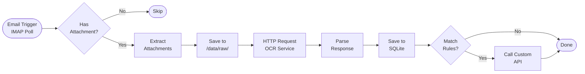

### 4.2 WhatsApp Ingestion Workflow

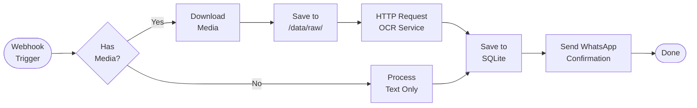

### 4.3 Processing Workflow (Called by Upload)

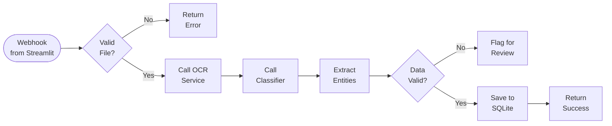

---

## 5. Data Flow

### 5.1 Document Processing Flow

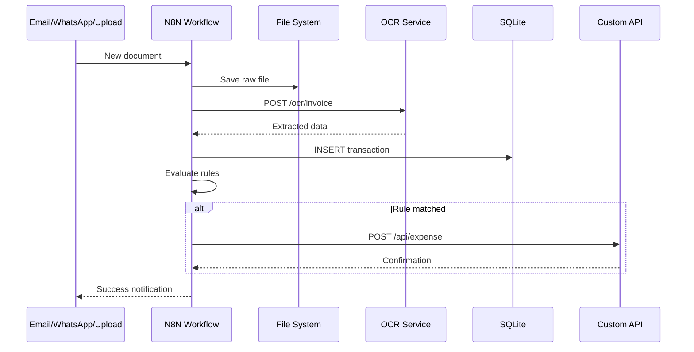

### 5.2 Chat Query Flow

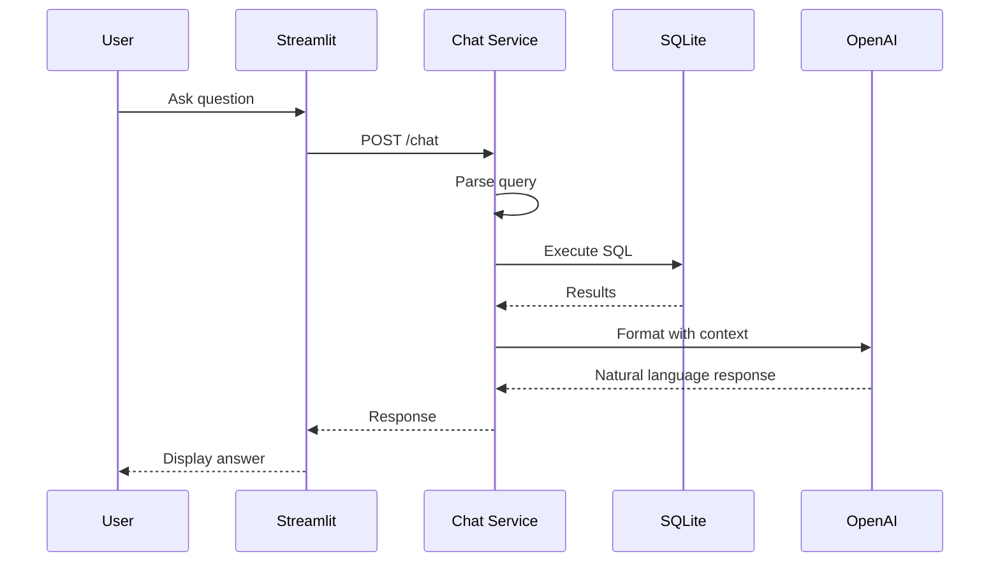

---

## 6. Database Schema (SQLite)

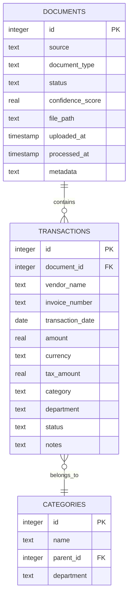

---

## 7. Streamlit UI Structure

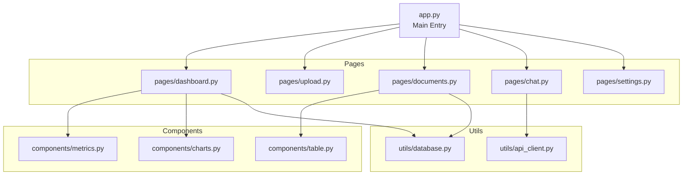

---

## 8. File Structure

```
POC-info-collect/
├── docker-compose.yml
├── .env
├── README.md
│
├── data/                      # Shared volume
│   ├── raw/                   # Raw uploaded files
│   │   ├── email/
│   │   ├── whatsapp/
│   │   └── upload/
│   ├── database.db            # SQLite database
│   └── n8n/                   # N8N workflows & data
│
├── services/                  # Python services
│   ├── Dockerfile
│   ├── requirements.txt
│   ├── main.py               # FastAPI app
│   ├── ocr_service.py
│   ├── classifier.py
│   └── chat_service.py
│
├── frontend/                  # Streamlit UI
│   ├── Dockerfile
│   ├── requirements.txt
│   ├── app.py                # Main Streamlit app
│   ├── pages/
│   │   ├── dashboard.py
│   │   ├── upload.py
│   │   ├── documents.py
│   │   ├── chat.py
│   │   └── settings.py
│   ├── components/
│   │   ├── metrics.py
│   │   └── charts.py
│   └── utils/
│       ├── database.py
│       └── api_client.py
│
└── n8n-workflows/            # N8N workflow exports
    ├── email_ingestion.json
    ├── whatsapp_ingestion.json
    ├── processing.json
    └── api_integration.json
```

---

## 9. Network & Ports

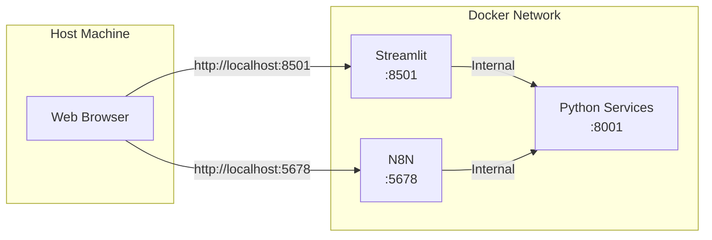

**Port Mapping:**
- `5678` → N8N Web UI
- `8001` → Python Services API
- `8501` → Streamlit UI

---

## 10. Deployment Flow

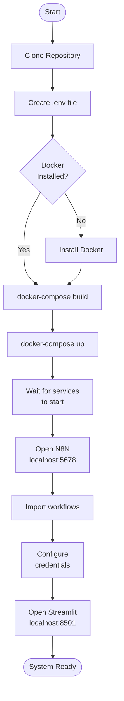

---

## 11. Cost Comparison

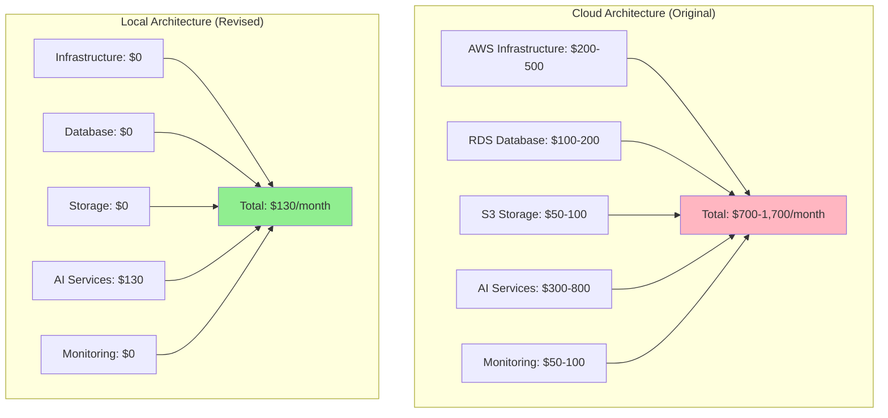

**92% Cost Reduction!**

---

## 12. Scaling Path

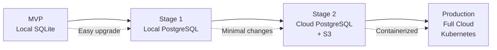

---

## 13. Integration Architecture

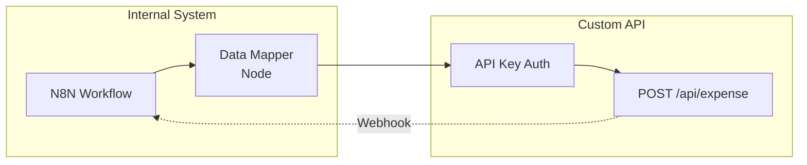

**N8N HTTP Request Node Configuration:**
```json
{
  "method": "POST",
  "url": "https://your-api.com/api/expense",
  "authentication": "headerAuth",
  "headerAuth": {
    "name": "X-API-Key",
    "value": "your-api-key"
  },
  "body": {
    "vendor": "={{$json.vendor_name}}",
    "amount": "={{$json.amount}}",
    "date": "={{$json.transaction_date}}",
    "category": "={{$json.category}}"
  }
}
```

---

## 14. Monitoring (Simple)

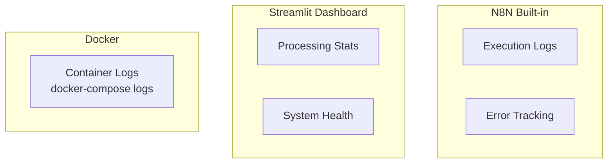

**Monitoring Commands:**
```bash
# View N8N logs
docker-compose logs -f n8n

# View Python service logs
docker-compose logs -f python-services

# View Streamlit logs
docker-compose logs -f streamlit

# Check system status
docker-compose ps
```

---

*This revised architecture provides a practical, cost-effective solution that can be deployed locally and scaled to cloud when needed.*
