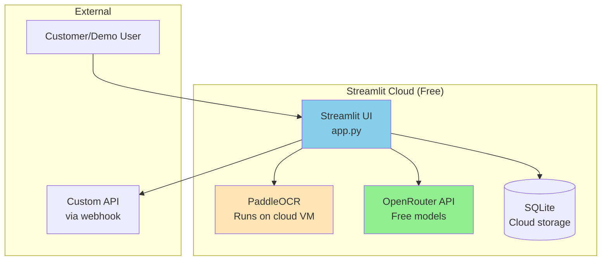
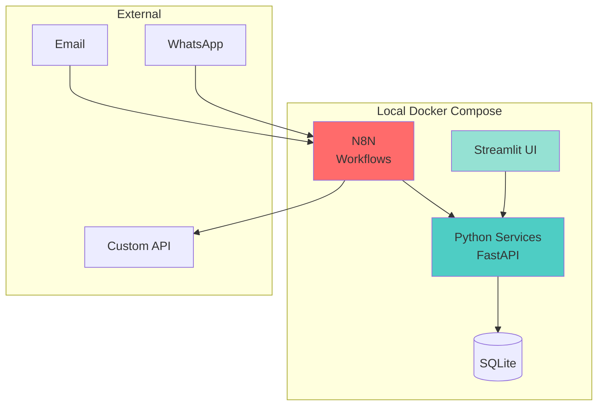

# Deployment Options - Streamlit Cloud + Local

## Overview

This POC supports **two deployment modes**:
1. **Streamlit Cloud** - For customer demos, testing, and public access
2. **Local Docker Compose** - For production, privacy-sensitive data, and full control

---

## Deployment Strategy Comparison

| Feature | Streamlit Cloud | Local Docker Compose |
|---------|----------------|---------------------|
| **Use Case** | Customer demos, testing | Production, sensitive data |
| **Setup Time** | 5 minutes | 30 minutes |
| **Cost** | FREE | $0 (self-hosted) |
| **Privacy** | ⚠️ Data on cloud | ✅ 100% local |
| **OCR** | PaddleOCR (cloud VM) | PaddleOCR (local) |
| **LLM** | OpenRouter/OpenAI | OpenRouter/Ollama |
| **Database** | SQLite (cloud) | SQLite (local) |
| **N8N Workflows** | ❌ Not available | ✅ Full automation |
| **Custom API** | ✅ Via webhooks | ✅ Direct integration |
| **Best For** | Demos, prototypes | Real usage, privacy |

---

## Option 1: Streamlit Cloud Deployment (For Demos)

### Architecture



### Setup Steps

**1. Prepare Repository for Streamlit Cloud**

Create simplified structure:
```
POC-info-collect/
├── streamlit_app.py          # Main Streamlit app (renamed from app.py)
├── requirements.txt           # Python dependencies
├── packages.txt              # System dependencies (for PaddleOCR)
├── .streamlit/
│   └── config.toml           # Streamlit configuration
├── pages/
│   ├── 1_📤_Upload.py
│   ├── 2_📄_Documents.py
│   └── 3_💬_Chat.py
├── utils/
│   ├── ocr_service.py        # PaddleOCR integration
│   ├── chat_service.py       # OpenRouter integration
│   └── database.py           # SQLite utilities
└── data/
    └── .gitkeep              # Placeholder (data stored in cloud)
```

**2. Create `requirements.txt` for Streamlit Cloud**

```txt
streamlit==1.31.0
paddlepaddle==2.6.0
paddleocr==2.7.3
Pillow==10.2.0
openai==1.12.0
requests==2.31.0
pandas==2.2.0
plotly==5.18.0
python-dotenv==1.0.1
```

**3. Create `packages.txt` (System Dependencies)**

```txt
libgl1-mesa-glx
libglib2.0-0
```

**4. Configure Streamlit Secrets**

In Streamlit Cloud dashboard, add secrets:
```toml
# .streamlit/secrets.toml (for local testing)
# In Streamlit Cloud: Settings > Secrets

[openrouter]
api_key = "your-openrouter-key"

[openai]
api_key = "your-openai-key"  # Fallback only

[custom_api]
url = "https://your-api.com/api/expense"
api_key = "your-api-key"

[settings]
ocr_engine = "paddleocr"
llm_provider = "openrouter"
strict_privacy_mode = false  # Cloud mode
```

**5. Deploy to Streamlit Cloud**

1. Push code to GitHub
2. Go to [share.streamlit.io](https://share.streamlit.io)
3. Connect GitHub repository
4. Select `streamlit_app.py` as main file
5. Add secrets in dashboard
6. Deploy!

**URL**: `https://your-app-name.streamlit.app`

---

### Streamlit Cloud Code Structure

#### Main App (`streamlit_app.py`)

```python
import streamlit as st
from utils.database import init_database

st.set_page_config(
    page_title="Info Collection POC",
    page_icon="📄",
    layout="wide",
    initial_sidebar_state="expanded"
)

# Initialize database
init_database()

# Main page
st.title("📄 Information Collection System")
st.markdown("### POC Demo - Privacy-Focused Document Processing")

st.info("""
**Demo Mode**: This is running on Streamlit Cloud for demonstration purposes.
- ✅ PaddleOCR for local processing
- ✅ OpenRouter free models for chat
- ✅ SQLite for data storage
- ⚠️ Data is stored on cloud VM (not recommended for sensitive data)

**For production**: Use local Docker Compose deployment for 100% privacy.
""")

# Metrics
col1, col2, col3 = st.columns(3)

with col1:
    st.metric("Documents Processed", "0")
with col2:
    st.metric("Total Amount", "$0.00")
with col3:
    st.metric("Categories", "15")

st.markdown("---")
st.markdown("👈 **Use the sidebar to navigate between pages**")
```

#### Upload Page (`pages/1_📤_Upload.py`)

```python
import streamlit as st
from utils.ocr_service import process_document
from utils.database import save_document
import tempfile
import os

st.title("📤 Upload Document")

uploaded_file = st.file_uploader(
    "Choose a file (PDF, JPG, PNG)",
    type=["pdf", "jpg", "jpeg", "png"]
)

if uploaded_file:
    # Display preview
    if uploaded_file.type.startswith("image"):
        st.image(uploaded_file, caption="Uploaded Image", use_column_width=True)
    
    if st.button("Process Document", type="primary"):
        with st.spinner("Processing with PaddleOCR..."):
            # Save to temp file
            with tempfile.NamedTemporaryFile(delete=False, suffix=os.path.splitext(uploaded_file.name)[1]) as tmp:
                tmp.write(uploaded_file.getbuffer())
                tmp_path = tmp.name
            
            try:
                # Process with OCR
                result = process_document(tmp_path)
                
                if result["status"] == "success":
                    st.success("✅ Document processed successfully!")
                    
                    # Display extracted data
                    st.subheader("Extracted Data")
                    col1, col2 = st.columns(2)
                    
                    with col1:
                        st.write("**Vendor:**", result["data"].get("vendor_name", "N/A"))
                        st.write("**Invoice #:**", result["data"].get("invoice_number", "N/A"))
                        st.write("**Date:**", result["data"].get("transaction_date", "N/A"))
                    
                    with col2:
                        st.write("**Amount:**", f"${result['data'].get('amount', 0):.2f}")
                        st.write("**Tax:**", f"${result['data'].get('tax_amount', 0):.2f}")
                        st.write("**Confidence:**", f"{result['data'].get('confidence', 0)*100:.1f}%")
                    
                    # Save to database
                    save_document(result["data"])
                    
                    with st.expander("View Raw Text"):
                        st.text(result["data"].get("raw_text", ""))
                else:
                    st.error(f"❌ Processing failed: {result.get('message', 'Unknown error')}")
            
            finally:
                os.unlink(tmp_path)
```

#### Chat Page (`pages/3_💬_Chat.py`)

```python
import streamlit as st
from utils.chat_service import process_query

st.title("💬 Chat Assistant")

# Initialize chat history
if "messages" not in st.session_state:
    st.session_state.messages = []

# Display chat messages
for message in st.session_state.messages:
    with st.chat_message(message["role"]):
        st.markdown(message["content"])

# Chat input
if prompt := st.chat_input("Ask about your expenses..."):
    # Add user message
    st.session_state.messages.append({"role": "user", "content": prompt})
    with st.chat_message("user"):
        st.markdown(prompt)
    
    # Get assistant response
    with st.chat_message("assistant"):
        with st.spinner("Thinking..."):
            result = process_query(prompt)
            st.markdown(result["answer"])
            
            if result.get("data"):
                with st.expander("View Data"):
                    st.json(result["data"])
            
            st.session_state.messages.append({
                "role": "assistant",
                "content": result["answer"]
            })

# Sidebar suggestions
with st.sidebar:
    st.subheader("💡 Suggested Queries")
    if st.button("What's the total amount?"):
        st.rerun()
    if st.button("Show expenses by category"):
        st.rerun()
    if st.button("Top 5 vendors"):
        st.rerun()
```

---

## Option 2: Local Docker Compose (For Production)

### Architecture (Full System)



**Full features:**
- ✅ N8N workflows (email, WhatsApp ingestion)
- ✅ 100% local processing
- ✅ Complete privacy
- ✅ Custom API integration

---

## Hybrid Deployment Strategy

### Recommended Approach

**Phase 1: Demo (Streamlit Cloud)**
- Deploy simplified Streamlit app to cloud
- Use for customer demos and testing
- Manual upload only (no N8N)
- OpenRouter free models

**Phase 2: Production (Local)**
- Deploy full Docker Compose stack
- Enable N8N workflows
- Process real customer data
- Full privacy mode

---

## Deployment Checklist

### Streamlit Cloud Deployment
- [ ] Create simplified `streamlit_app.py`
- [ ] Add `requirements.txt` and `packages.txt`
- [ ] Configure secrets in Streamlit Cloud
- [ ] Push to GitHub
- [ ] Deploy on share.streamlit.io
- [ ] Test upload and chat features
- [ ] Share demo URL with customers

### Local Docker Deployment
- [ ] Set up Docker Compose
- [ ] Configure N8N workflows
- [ ] Set up email/WhatsApp ingestion
- [ ] Configure custom API integration
- [ ] Test end-to-end workflows
- [ ] Enable privacy mode

---

## Cost Comparison

| Deployment | Infrastructure | AI Services | Total |
|-----------|---------------|-------------|-------|
| **Streamlit Cloud** | FREE | $0-20/month | **$0-20/month** |
| **Local Docker** | $0 (self-hosted) | $0-20/month | **$0-20/month** |

**Both options are cost-effective!**

---

## Privacy Considerations

### Streamlit Cloud (Demo)
- ⚠️ Data stored on Streamlit's cloud servers
- ⚠️ OCR processing happens on cloud VM
- ✅ Can use OpenRouter (minimal data sharing)
- ⚠️ **Not recommended for sensitive customer data**

### Local Docker (Production)
- ✅ 100% data stays on your infrastructure
- ✅ OCR processing completely local
- ✅ Can use Ollama for 100% local LLM
- ✅ **Recommended for production/sensitive data**

---

## Next Steps

1. **Create Streamlit Cloud version** (simplified, demo-ready)
2. **Keep local Docker Compose version** (full features, privacy)
3. **Document both deployment options** in README
4. **Use Streamlit Cloud for demos**, local for production

---

*This dual-deployment strategy gives you flexibility: cloud for demos, local for privacy!*
